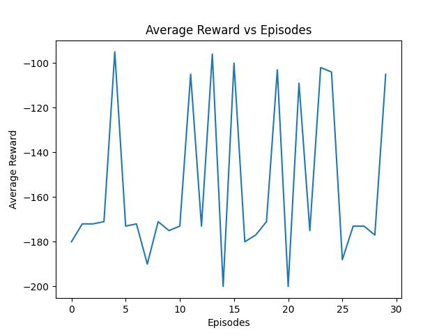
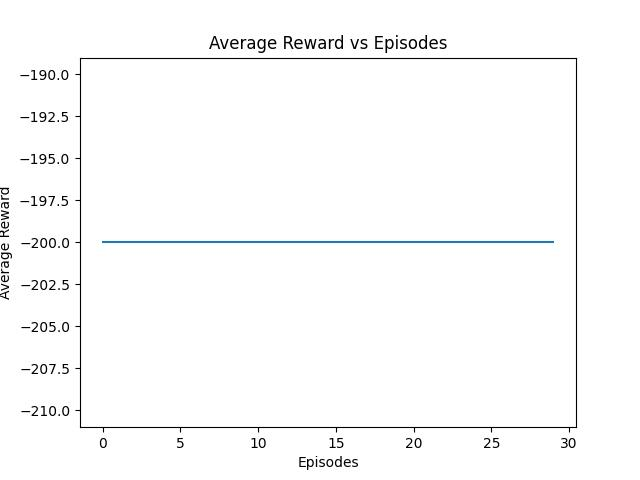

# Deep RL/Robotics Write Up

# Classical Control Problem - Mountain Car

## Problem Description
A car is on a one-dimensional track, positioned between two "mountains". The goal is to drive up the mountain on the right; however, the car's engine is not strong enough to scale the mountain in a single pass. Therefore, the only way to succeed is to drive back and forth to build up momentum. [OpenAI Gym](https://gym.openai.com/envs/MountainCar-v0/)

## Environment
The environment is a simple 2D space that contains the following information:

1.   State: The state is a 1d vector that contains the position and velocity of the car e.g [1, 0.7]
2.   Actions: The car has only 3 possible actions at every state. It can either accelerate forward, backward or do nothing.

## Neural Network Description
**Architecture**

The neural network implemented was a sequential neural network with two dense layers.

1.   Input layer: The input is a (1x2) vector that contains the postion of the car 
2.   Dense layer: Fully connected 128 x 58 dense layers with the Rectified Linear Unit (ReLU) as activation function
3. Output layer: The output is a single scalar that takes on a value of either moving left, staying idle or moving right

**Training Process**

1.   The game is played 10,000 times at random to generate a training data set. For each iteration, the state is mapped to the action that got it there. 
2.   The NN performs a supervised learning approach by learning what actions are most likely to generate a desired state
3. The model is trained over 10 epochs with the Mean Squared Error (MSE) loss function and Adam optimizer

NB: Ten (10) epochs selected as it reported the best fit state. Later than 10 started showing an increase in validation loss and decrease in train loss which is a sign for overfitting. Model accuracy showed no noticeable change after that 

## Agent Behaviour as Model Converges

Using the neural network and record of previous state (Q-learning), the agent seemed to be getting a grasp on the best way to climb up the hill. It initially started with there cycles: move back and forth, move back and forth again and finally going on top of the hill.

As the episodes increased, the agent seemed to have learned a better way to climb up the hill. There included some rare occasions where the agent went up the hill with a single back and forth.

## Steps vs Reward Graphs

**Using Deep NN**

**Random Agent**

**Comparison**
From the graphs above, we can see that the deep NN agent learns from past experience and thus has in increase in the total rewards although not consistent. While the random agent has a consistent total reward of -200 due to the fact that it doesn't learn from past experiences.

## Whether agent has learnt optimal policy?

The agent seemed to get better as the gameplay progresses. However, large reward deficits still ensue.
